# NL2SQL Agent with Vanna 2.0, Qwen2.5-Coder, and PostgreSQL

This project is an advanced Natural Language to SQL (NL2SQL) agent powered by **Vanna 2.0**, local **Ollama** models, and **ChromaDB**. It connects to a local PostgreSQL database (`dvdrental` by default) and allows users to ask questions in plain English, which the AI autonomously converts into SQL, executes, and summarizes.

Because we are using `qwen2.5-coder:32b`—a model highly optimized for coding but lacking native Ollama tool-calling support—this project includes custom **interceptors** and **sanitizers** to seamlessly bridge the gap.

## 🌟 Key Features

1. **Custom LLM Interceptor (`CoderOllamaLlmService`)**
   - Extracts raw JSON tool calls generated by Qwen2.5-Coder.
   - Converts them into Vanna-compatible native `ToolCall` structures on the fly.
2. **Safe PostgreSQL Runner (`SafePostgresRunner`)**
   - Intercepts data returning from PostgreSQL.
   - Safely handles binary columns (like `bytea` returning as Python `memoryview` objects) by replacing them with a safe placeholder string (`"<binary_data>"`), preventing Pydantic serialization crashes in the web UI.
3. **Optimized Vector Memory (`CustomChromaMemory`)**
   - Automatically seeds ChromaDB with your database schema.
   - Lowers the default vector similarity threshold to `0.4` to perfectly accommodate the cosine distances produced by the `nomic-embed-text` embedding model.

---

## 🏗️ Architecture & Execution Flow

Below is the end-to-end execution flow of a user prompt through the system:

```mermaid
sequenceDiagram
    autonumber
    actor User
    participant UI as Web UI
    participant Agent as Vanna Agent
    participant Chroma as ChromaDB (Memory)
    participant Interceptor as CoderOllamaLlmService
    participant LLM as qwen2.5-coder:32b
    participant Runner as SafePostgresRunner
    participant PG as PostgreSQL (dvdrental)

    rect rgb(30, 30, 40)
    Note over User, Chroma: PHASE 1: CONTEXT INJECTION
    User->>UI: Submits Prompt (e.g., "Give me tables...")
    UI->>Agent: Routes Prompt
    Agent->>Chroma: Embeds prompt & searches (Threshold 0.4)
    Chroma-->>Agent: Returns Schema & Context Matches
    Agent->>Agent: Compiles System Prompt (Context + Tools)
    end

    rect rgb(40, 30, 30)
    Note over Agent, LLM: PHASE 2: GENERATION & INTERCEPTION
    Agent->>Interceptor: Sends massive system prompt
    Interceptor->>LLM: Forwards prompt
    LLM-->>Interceptor: Outputs raw JSON (requests 'run_sql')
    Interceptor->>Interceptor: Parses JSON, hides text, builds ToolCall
    Interceptor-->>Agent: Returns structured ToolCall
    end

    rect rgb(30, 40, 30)
    Note over Agent, PG: PHASE 3: EXECUTION & OUTPUT
    Agent->>Runner: Passes ToolCall containing SQL
    Runner->>PG: Executes SQL string
    PG-->>Runner: Returns Raw Data (contains memoryviews)
    Runner->>Runner: Sanitizes Data (Replaces bytea with <binary_data>)
    Runner-->>UI: Streams safe DataFrame to UI table
    Runner-->>Agent: Returns safe DataFrame to Agent Loop
    
    Agent->>Interceptor: Requests summary of DataFrame
    Interceptor->>LLM: "Summarize this data for the user"
    LLM-->>Interceptor: Generates Final Answer
    Interceptor-->>Agent: Returns Final Answer
    Agent-->>UI: Displays conversational response
    end
```



---

## ⚙️ Prerequisites

1. **Python 3.10+**
2. **PostgreSQL**: Running locally or accessible via network.
3. **Ollama**: Running locally or on a remote machine.
   ```bash
   ollama pull qwen2.5-coder:32b
   ollama pull nomic-embed-text
   ```

---

## 🚀 Setup Instructions

### 1. Configure `.env`
Create a `.env` file in the root of your directory to define your database credentials and Ollama API endpoints. This prevents hardcoding secrets into your codebase.

```env
# Database Credentials
DB_HOST=localhost
DB_PORT=5432
DB_NAME=dvdrental
DB_SCHEMA=public
DB_USER=postgres
DB_PASSWORD=your_secure_password

# AI / Model Configurations
OLLAMA_API_URL=http://127.0.0.1:11434
LLM_MODEL=qwen2.5-coder:32b
LLM_NUM_CTX=32768
EMBED_MODEL=nomic-embed-text

# Memory Storage
CHROMA_DIR=./chroma_db
COLLECTION_NAME=vanna_memory
```

> **Note:** We use `OLLAMA_API_URL` instead of `OLLAMA_HOST` to prevent collision with Windows global environment variables that might be set to `0.0.0.0`.

### 2. Seed the Database Schema (Training)
Vanna needs to "learn" your database structure. Run the `train.py` script to connect to your PostgreSQL database, extract the entire schema (tables, columns, foreign keys), and embed it into the local ChromaDB vector store.

```bash
# Basic schema seeding
python train.py

# Full clean re-seed (Drops existing ChromaDB collection)
python train.py --reset

# Add example Question-to-SQL pairs to guide the LLM
python train.py --add-examples
```

*Note: The schema extraction logic is completely generic and will work automatically on ANY PostgreSQL database you point it at in the `.env` file. (Only the example queries are hardcoded to the dvdrental database).*

### 3. Start the Web App
Once the schema is trained, start the Vanna web interface:

```bash
python app.py
```

Open your browser and navigate to the local URL (usually `http://localhost:8000`). You can now start chatting with your database!

---

## 📁 File Structure Overview

- `config.py`: Core logic wiring. Contains the Vanna agent instantiation, the `SafePostgresRunner`, and the `CoderOllamaLlmService` interceptor.
- `train.py`: Extracts PostgreSQL schemas and seeds ChromaDB with natural language and DDL memories.
- `app.py`: Simple entry point to launch the Vanna FastAPI web server.
- `.env`: Source of truth for database and API configuration.
